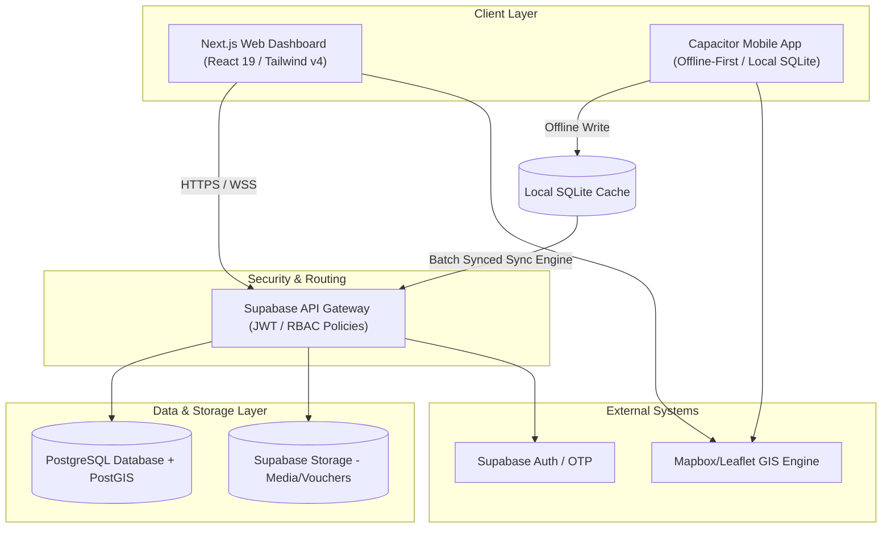
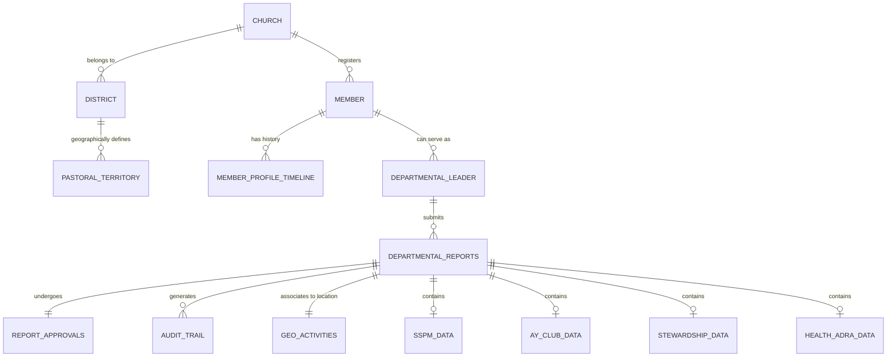
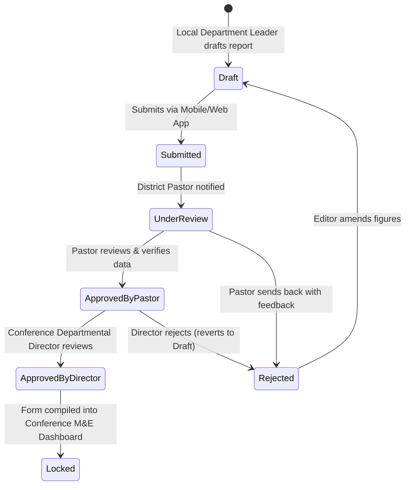

# System Scaling & Integration Blueprint: Comprehensive Mission & Ministry Management System
**East Zimbabwe Conference (EZC) of the Seventh-day Adventist Church**

---

## 1. Executive Scaling Strategy

To expand the existing hybrid system (**Next.js Web Dashboard** and **Vite React + Capacitor Mobile App**) into a Comprehensive Mission & Ministry Management System, we must scale the architecture along three primary dimensions: **Data Volume**, **Operational Roles**, and **Offline Resiliency**.

The architectural model leverages a **Centralized API & Synced Data Layer** built on top of Supabase, utilizing PostgreSQL’s spatial capabilities (PostGIS) to tie human ministry reports to spatial polygons (pastoral territories).

### High-Level Architecture Overview


### Key Scaling Principles:
1. **Separation of Read & Write Concerns (CQRS-lite)**: 
   * The **Mobile App** acts as a write-heavy, transactional data-collector. It writes to local storage (SQLite) first, then pushes structured JSON batches to the database.
   * The **Web Dashboard** is read-heavy. To prevent heavy spatial computations (e.g., dynamically calculating membership density inside pastoral boundaries on every page load), we implement materialised views in Postgres, refreshed hourly or via Database Webhooks.
2. **Stateless Middleware & Serverless Triggers**:
   * Departmental report aggregation, workflow routing, and notification dispatches are managed via **Supabase Edge Functions**. This ensures that the Next.js frontend remains focused on rendering the UI and Leaflet overlays.
3. **Partitioning and Archiving**:
   * Reports and activity logs are partitioned by **Ecclesiastical Year** and **Conference District**. Historical geo-activities are stored in cold storage or separated tables to keep the active spatial query latency below 200ms.

---

## 2. Database & Data Model Expansion

The database schema maps the Seventh-day Adventist hierarchical structure: *Local Church ➔ District ➔ Conference*. 

To integrate new departmental modules without modifying existing core tables (which hold boundary coordinates and basic member records), we employ a **Common Departmental Schema Pattern** utilizing a shared `departmental_reports` table linked to department-specific dynamic tables.

### Logical Entity-Relationship Diagram (ERD)



### Table Definitions (SQL Concepts)

#### 1. Core Departmental Report Wrapper
This table acts as the unified intake wrapper for all incoming departmental reports. It manages routing, workflow status, geo-tagging, and verification status.

```sql
CREATE TYPE approval_status AS ENUM ('draft', 'submitted', 'reviewed_by_pastor', 'approved_by_director', 'rejected');

CREATE TABLE departmental_reports (
    id UUID PRIMARY KEY DEFAULT gen_random_uuid(),
    local_church_id UUID REFERENCES churches(id) ON DELETE RESTRICT,
    submitted_by UUID REFERENCES members(id) ON DELETE RESTRICT,
    department_code VARCHAR(10) NOT NULL, -- 'SSPM', 'AY', 'WM', 'AMO', 'CM', 'STEW', 'HEALTH', 'COMM'
    reporting_period_start DATE NOT NULL,
    reporting_period_end DATE NOT NULL,
    status approval_status DEFAULT 'draft',
    created_at TIMESTAMP WITH TIME ZONE DEFAULT timezone('utc'::text, now()) NOT NULL,
    updated_at TIMESTAMP WITH TIME ZONE DEFAULT timezone('utc'::text, now()) NOT NULL
);
```

#### 2. Geo-Contextualized Activities Link
Associates a specific event/outreach reported by any department to a precise point, line, or polygon on the conference map.

```sql
CREATE TABLE geo_activities (
    id UUID PRIMARY KEY DEFAULT gen_random_uuid(),
    report_id UUID REFERENCES departmental_reports(id) ON DELETE CASCADE,
    activity_name VARCHAR(255) NOT NULL,
    geom GEOMETRY(Geometry, 4326) NOT NULL, -- Point (e.g. Health Expo site) or Polygon (Target Area)
    attendance_count INTEGER DEFAULT 0,
    narrative_summary TEXT,
    captured_offline BOOLEAN DEFAULT false,
    gps_accuracy_meters NUMERIC(5,2)
);
```

#### 3. Structured Audit Log
Guarantees absolute traceability. This table is write-only; delete/update permissions are revoked for all database roles except system superusers.

```sql
CREATE TABLE system_audit_trail (
    id BIGSERIAL PRIMARY KEY,
    entity_name VARCHAR(100) NOT NULL, -- 'departmental_reports', 'member_profiles'
    entity_id UUID NOT NULL,
    action_type VARCHAR(10) NOT NULL, -- 'INSERT', 'UPDATE', 'APPROVE', 'REJECT'
    performed_by UUID REFERENCES members(id) NOT NULL,
    ip_address INET,
    client_user_agent TEXT,
    timestamp TIMESTAMP WITH TIME ZONE DEFAULT timezone('utc'::text, now()) NOT NULL,
    old_state JSONB,
    new_state JSONB
);
```

#### 4. Member Profile Timeline (Member 360°)
Aggregates member involvement across their life cycle.

```sql
CREATE TABLE member_profile_timeline (
    id UUID PRIMARY KEY DEFAULT gen_random_uuid(),
    member_id UUID REFERENCES members(id) ON DELETE CASCADE,
    event_date DATE NOT NULL,
    event_type VARCHAR(50) NOT NULL, -- 'baptism', 'pathfinder_induction', 'ay_leader_induction', 'stewardship_cert'
    department_code VARCHAR(10),
    description TEXT NOT NULL,
    verified_by UUID REFERENCES members(id),
    created_at TIMESTAMP WITH TIME ZONE DEFAULT timezone('utc'::text, now()) NOT NULL
);
```

---

## 3. Detailed Departmental Workflows

All workflows align with official Seventh-day Adventist Church Manual practices and operational policies.

### Summary Workflow Matrix

| Department | Primary Metrics Captured | Frequency | Approval Path |
| :--- | :--- | :--- | :--- |
| **SSPM** | Small Groups (Care Groups) active, Bible studies, Baptism pipeline, Spiritual gift surveys, volunteer logging. | Weekly metrics, Monthly roll-up | Local Leader ➔ District Pastor ➔ Conf. Personal Ministries Director |
| **AY & Pathfinders** | Club membership, weekly attendance, honors completed, Camporee status, Youth Evangelism campaigns. | Monthly | Club Director ➔ District Pastor ➔ Conf. Youth Director |
| **Women's Min (WM)** | Mentorship pairs active, Retreat attendances, Outreach projects, Circle of Hope initiatives. | Quarterly | WM Leader ➔ District Pastor ➔ Conf. WM Director |
| **Men's Org (AMO)** | Men's fellowship attendees, Fatherhood/Marriage seminars, Community service projects. | Quarterly | AMO Leader ➔ District Pastor ➔ Conf. AMO Director |
| **Children's Min (CM)** | Sabbath school class size, VBS attendees, Child Protection/Safety compliance checks. | Monthly / VBS Campaign | CM Leader ➔ District Pastor ➔ Conf. CM Director |
| **Stewardship** | Tithe & Offering return rate (conceptual link), Stewardship seminars, Budget vs Actual variance. | Monthly | Stewardship Sec. ➔ Church Board/Pastor ➔ Conf. Stewardship Dir |
| **Health & ADRA** | Health expo consultations, Medical camp patients, NEWSTART course completions, ADRA relief. | Event-driven / Quarterly | Health Leader ➔ District Pastor ➔ Conf. Health/ADRA Dir |
| **Comm & PARL** | Broadcast minutes, Newsletter articles, Religious liberty cases, Government relation meetings. | Quarterly | Comm Secretary ➔ District Pastor ➔ Conf. Comm Director |

---

### Step-by-Step Approval Routing Engine

The digital report routing uses a strictly defined multi-stage validation pipeline:



1. **Submission Stage (Local Church)**:
   * Local Department Leader fills out the data form. If offline, the app caches the entry.
   * Upon network detection, the local record is synchronized, creating a `departmental_reports` row with status `submitted`.
2. **Review Stage (District Pastor)**:
   * The District Pastor receives an in-app notification and email containing a summary.
   * The Pastor reviews the report and validates it against local church records. 
   * Actions: **Approve** (advances to `reviewed_by_pastor`) or **Reject** (status reverts to `draft` with comments returned).
3. **Approval Stage (Conference Departmental Director)**:
   * The Director reviews aggregated district metrics.
   * Actions: **Approve** (status transitions to `approved_by_director` and locks the database record) or **Reject** (reverts state).

---

## 4. Traceable Reporting & M&E Framework

### Key Performance Indicators (KPIs) & Dashboard Layouts

Conference leadership (Presidents, Secretaries, and Treasurers) need high-level charts. The Next.js dashboard renders these dynamically:

* **Baptismal Conversion Rate (BCR)**: 
  $$\text{BCR} = \left(\frac{\text{Baptisms (Current Quarter)}}{\text{Active Bible Study Candidates (Previous Quarter)}}\right) \times 100$$
* **Youth Retention Rate (YRR)**: Tracks the net change in active youth profiles (AY, Pathfinders) over a rolling 12-month period, correlating it to overall baptisms.
* **Reporting Compliance Score**: Percentage of local churches in a district that submit their departmental report within 5 days of the period ending.
* **Unreached Territory Penetration Index**: Calculated by comparing GIS polygon layers of unreached ZIP codes or villages with geo-located Personal Ministries or Health expo events.

```
+-----------------------------------------------------------------------------------+
|                           EZC LEADERSHIP COMMAND CENTER                           |
+--------------------+--------------------------------+-----------------------------+
|    COMPLIANCE      |        MEMBERSHIP TRENDS       |     UNREACHED PENETRATION   |
|  [||||||||||] 84%  |  Baptized: +1,240 (This Year)  |  Zones Penetrated: 34 / 80  |
|  (Avg. Delay: 2d)  |  Youth Retention: 92%          |  Active Expos: 12           |
+--------------------+--------------------------------+-----------------------------+
|                                                                                   |
|                               CONFERENCE SPATIAL MAP                              |
|   +---------------------------------------------------------------------------+   |
|   |  [Map View: Harare East District]                                         |   |
|   |  - Red Polygons: Pastoral Territory Boundaries                            |   |
|   |  - Green Markers: Active Personal Ministries Bible Study Groups           |   |
|   |  - Blue Markers: Health Expo / ADRA Humanitarian Sites                    |   |
|   |                                                                           |   |
|   +---------------------------------------------------------------------------+   |
|                                                                                   |
+-----------------------------------------------------------------------------------+
|  AUDIT LOGS: (10:14) Elder Sibanda submitted SSPM report (Mbare East Church)      |
|              (10:18) Pastor Moyo approved Youth report (Highfields District)      |
+-----------------------------------------------------------------------------------+
```

### Audit-Trail Mechanism
To prevent data tampering (especially for metrics linked to baptism and financial budgets):
1. **JWT Verification**: Every query is signed using Supabase JWT tokens containing the member's verified identity and ecclesiastical role.
2. **Row-Level Security (RLS)**: Policies ensure local leaders can only write rows mapped to their corresponding `local_church_id`.
3. **Change-State Diff**: The `system_audit_trail` table captures the `old_state` and `new_state` as JSONB columns during updates, identifying exactly which metrics were altered during review.

---

## 5. Offline Sync & Data Conflict Resolution Strategy

Local leaders in rural sectors of the East Zimbabwe Conference face sporadic cellular coverage. The system must operate completely offline.

### Mobile Offline Architecture
The mobile application uses an embedded **SQLite Database** (accessed via Capacitor SQLite plugin) acting as the local synchronization cache.

```
       [User Input (Pathfinder Form)]
                     │
                     ▼
       ┌───────────────────────────┐
       │ Write to Local SQLite     │  ◄── Immediate UI success
       └─────────────┬─────────────┘
                     │
                     ▼
         [Network Connection Test]
                    ╱ ╲
                  ╱     ╲
           (YES)╱         ╲(NO)
              ╱             ╲
             ▼               ▼
     ┌──────────────┐  ┌───────────────┐
     │ Trigger Sync │  │ Queue Sync    │
     │ Queue        │  │ Action in     │
     └──────┬───────┘  │ SQLite        │
            │          └───────────────┘
            ▼
     ┌──────────────┐
     │ Push Batches │
     │ to Supabase  │
     └──────────────┘
```

### Sync & Conflict Resolution Rules

1. **Transactional Batch Sync**:
   * Reports containing nested arrays (e.g., club registration lists containing 50 youth profiles) are formatted into a single JSON transaction.
   * The sync engine uploads the transaction to a dedicated database ingestion function (`rpc_ingest_departmental_report`).
   * The function processes the header and child records in a single database transaction, ensuring no partial/orphan records are created.
2. **Data Conflict Resolution Rules**:
   * **Ecclesiastical Hierarchy Override**: Since metrics flow upward, if a Local Leader updates a report *after* a District Pastor has clicked "Approved", the database rejects the mobile write and triggers an alert: *"Report is locked by District Pastor. Request a correction rewrite."*
   * **Last-Write-Wins (LWW) with Conflict Log**: For demographic updates (e.g., changes to a member's phone number or address), the record with the most recent `updated_at` timestamp takes precedence. The overwritten record's details are written to the audit log.
   * **Deterministic UUID Generation**: The mobile application pre-generates UUID v4 values for all local inserts. This prevents PK collisions when multiple offline devices upload new records concurrently.

---

## 6. Phased Rollout Plan

To ensure high user adoption and reduce technical complexity, deployment is scheduled in 3-month increments:

```
Month:   1   2   3   4   5   6   7   8   9   10  11  12
         ┌───────────┐
Phase 1: │ Core/SSPM │
         └───────────┘
                     ┌───────────┐
Phase 2:             │Youth/Child│
                     └───────────┘
                                 ┌───────────┐
Phase 3:                         │WM/AMO/Hlth│
                                 └───────────┘
                                             ┌───────────┐
Phase 4:                                     │ M&E/Audit │
                                             └───────────┘
```

### Phase 1: Core Foundation, Member 360° & SSPM (Months 1-3)
* **Objective**: Establish the core user registers, RBAC groups, and the Sabbath School & Personal Ministries (SSPM) tracking module.
* **Deliverables**: Expanded member directories, base reporting forms, local-to-pastor approval engine, Care Group (Small Group) map layers.

### Phase 2: Youth & Children's Modules (Months 4-6)
* **Objective**: Scale the system to accommodate high-volume demographic reports (Pathfinder Clubs, Aventurer Clubs, and VBS campaigns).
* **Deliverables**: Youth profiles, honors tracker, safeguarding logs, camporee check-ins.

### Phase 3: Community & Specialty Ministries (Months 7-9)
* **Objective**: Roll out modules for Women's Ministries (WM), Men's Organization (AMO), Health Ministries & ADRA.
* **Deliverables**: Health Expo clinic patient trackers, ADRA emergency aid dispatch sheets, mentorship registry.

### Phase 4: Advanced M&E, Financial Linkages & System Audit (Months 10-12)
* **Objective**: Unlock advanced leadership capabilities and finalize the system security framework.
* **Deliverables**: Command center metrics dashboards, stewardship target visualizations, system audit trail viewer, and API read-only feeds for Union-level reporting.

---

## 7. Change Management & Adoption Strategy

Adoption of a digital platform in place of paper-based reports requires dedicated support for local officers.

1. **District-Level Digital Ambassadors**:
   * Train at least two tech-literate youth from each district (such as AY officers) as **Digital Ambassadors**.
   * These ambassadors provide hands-on troubleshooting for local church leaders and pastors during District Council meetings.
2. **Simplified In-App Training Videos**:
   * Pre-load 2-minute video walkthroughs directly inside the mobile app's dashboard.
   * Videos must show workflows like: *"How to submit a weekly care group report,"* or *"Checking a report as a District Pastor."*
3. **Data Subsidy and Support**:
   * Provide offline sync capabilities so leaders can fill out data at home, only needing connectivity for a few seconds when uploading.
   * The Conference provides a monthly mobile data bundle allowance to District Pastors to offset validation overhead.
4. **Bilingual User Interface**:
   * Full localization in **Shona**, **Ndebele**, and **English** within the mobile app, catering to the diverse linguistic demographics of the East Zimbabwe Conference.
